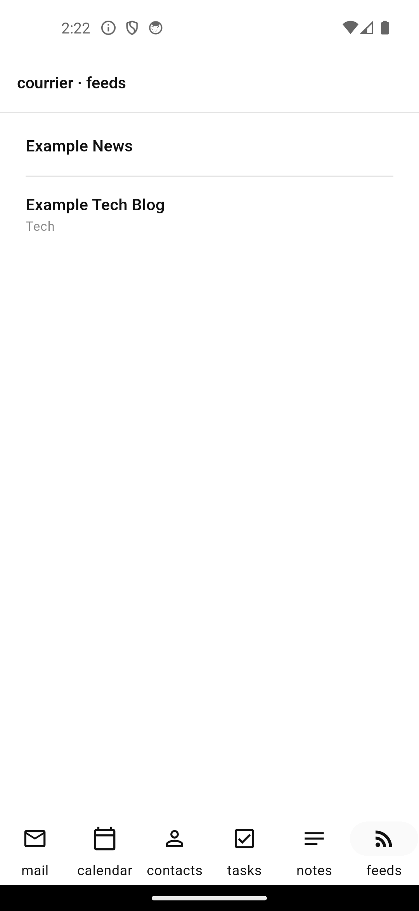

# Feeds

{width=320}

RSS / Atom subscriptions with two pull paths and one offline store.

## Two pull paths, one store

- **Nextcloud News API (primary)** — `NextcloudNewsClient` hits
  `/index.php/apps/news/api/v1-2/feeds` and `/items`. The user's News
  install is the single source of truth for read state across devices;
  `markRead` / `markUnread` PUT to `/items/{id}/read|unread`.
- **Direct fetch (bundled fallback)** — for any `FeedSubscriptions` row
  whose URL is a plain `http(s)://` feed, `FeedsSyncBackend` fetches the
  URL and pipes the body through `FeedParser`. No third-party dependency;
  the parser sits inside the binary.

Both paths upsert into `FeedItems` via `FeedRepository.upsertItem`, keyed
on `(feedId, guid)` so re-pulls are idempotent.

## The parser (`modules/feeds/parser/`)

`FeedParser` recognises:

| Form               | Field winners                                                              |
| ------------------ | -------------------------------------------------------------------------- |
| RSS 2.0 `<item>`   | `<content:encoded>` > `<description>`; `<guid>` > `<link>`; `<pubDate>` > `<dc:date>`; `<dc:creator>` for author |
| Atom 1.0 `<entry>` | `<content>` > `
`; `<id>` > `<link>`; `<published>` > `<updated>`; `<link rel="alternate">` preferred |

`pubDate` accepts both ISO 8601 and RFC 822 styles, including the
common `EST`/`PST`/`+0100` zone suffixes — the parser normalises every
value to UTC.

## CustomIntervalPicker (shared)

`core/widgets/custom_interval_picker.dart` ships the unit (minutes / hours
/ days) + amount input + emits integer minutes through `onChanged`. The
Feeds settings (M11 polish) use it for refresh interval; the M5 reminder
editor reuses it.

## UI

- **`FeedSubscriptionList`** — alphabetical, folder subtitle, single-green
  unread count badge (a bordered chip, no fills).
- **`FeedItemList`** — newest-first, unread dot in the single green
  accent, author + date subtitle.

## Sync semantics

- **News API path** mirrors read state down on every pull (an item with
  `unread: false` from the server flips `read=true` locally).
- **Direct fetch** doesn't carry read state — that's a per-device-only
  convenience. M11 polish wires a per-account "marked read at" cursor so
  the same browsing experience scales when the user runs courrier on more
  than one device against the same direct feeds.
- **Push** for the News-API path is a no-op at M10. M11 polish wires a
  pending-changes queue for read-state mirrors.

## Open at M10

- News-API push (queued read-state mirror) → M11.
- Per-feed refresh schedules (background timer per subscription) → M11.
- An OPML import surface to bootstrap a fresh install from a Thunderbird
  / Feedly / NetNewsWire export → M11 polish (the importer is mechanical;
  the UI surface is the missing piece).
