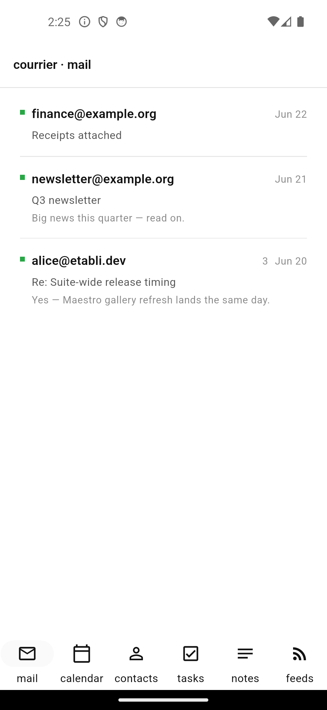

# Mail

{width=320}

{width=320}

The mail module is the biggest deliverable so far. M6 shipped the **read
path**: token-capable backend, real IMAP via `enough_mail`, in-memory demo
backend for sample content + tests + screenshots, offline store, threading,
**remote-content-off-by-default** MIME render, soft-delete trash + archive,
and local-first search. M7 adds **compose / send / autoconfig / push**. M8
layers OAuth2 (Microsoft 365) onto the existing backend without touching the
protocol stack.

## Surface

- **MailBackend** — auth-agnostic interface (PasswordCredentials OR
  XoauthBearerCredentials). Methods: connect/disconnect, listFolders,
  fetchEnvelopes (bounded window), fetchBody (lazy), applyFlags (batch),
  moveMessages, expungeTrash, appendMessage.
- **DemoMailBackend** — in-memory implementation seeded with realistic
  sample mail (3-message thread on References + In-Reply-To, an HTML
  newsletter carrying a remote tracker pixel, plain text, and a PDF
  attachment). Feeds the M13 Maestro screenshots + the M14 bundled
  sample-content path.
- **ImapMailBackend** — `enough_mail` ImapClient. `connect` accepts either
  password or XOAUTH2 bearer credentials. Per-folder bounded window pulls
  envelopes + headers eagerly; bodies fetched lazily on open. CONDSTORE /
  QRESYNC is M7's incremental gain.
- **MailRepository** — drift-backed. Mirrors folders into `MailFolders`,
  envelopes into `MailMessages` with `bodyDownloaded=false` until the user
  opens a thread.

## Threading

`threadsIn(folderName)` walks every message in the folder and groups them by
walking the `In-Reply-To` / `References` chain to a root, with a subject
fallback for older clients that drop the headers. Output: `MailThread`s,
each with messages in `receivedAt` ascending order; threads themselves are
returned newest-first. Tombstoned messages are excluded.

## MIME render with remote content OFF (audit dim 4 invariant)

`MimeRenderer` parses the HTML body with the `html` package and:

- Strips `<script>`, `<style>`, `<iframe>`, `<object>`, `<embed>`, `<form>`,
  `<input>`, `<button>` entirely.
- Removes every `on*` event handler.
- Removes `javascript:` URIs from `href` / `src`.
- **Replaces every remote `` with the placeholder `[image blocked]`.**
  Data URIs (`data:`) and `cid:` references are honoured; everything HTTP is
  blocked until the user explicitly reveals.
- Returns a plain-text representation only. The widget tree never carries
  raw HTML, so the M6 read path can't issue a network call at render time.

The "Show images" toggle on the message viewer flips `remoteContentAllowed`
in the DB. The renderer surfaces the *had-remote-content* flag so the toggle
appears when there is something to reveal — even when the body is text-only
and there's an HTML alternative.

## Soft-delete trash + archive

- `moveToTrash(messageIds)` — moves them to the `\Trash` special-use folder
  on the server AND tombstones locally (`trashed=true`, `trashedAt=now`).
- `archive(messageIds)` — moves them to the `\Archive` special-use folder.
  No tombstone; the messages are simply re-homed.
- `restoreFromTrash(messageIds, destinationFolderName)` — moves back and
  clears the tombstone.
- `emptyTrash()` — **the only path that EXPUNGEs.** Until then trashed
  messages are recoverable from the M11 Recycle Bin UI.

## Local-first search

`search(term)` runs a case-insensitive `LIKE` across `subject`,
`fromAddress`, `snippet`, `bodyText`. Each hit carries a
`snippet`-with-highlight string built from `bodyText` (or `snippet` as
fallback) — 32 chars of context around the match, ellipses on both sides
when truncated.

## Compose / send

- **`ComposeDraft`** — fromAddress, to/cc/bcc, subject, body text/html,
  attachments, inReplyTo + references for replies.
- **`MimeBuilder`** — wraps `enough_mail`'s `MessageBuilder` to emit RFC 5322
  bytes with the right MIME multipart layout. Honours In-Reply-To and
  References for replies; emits Cc + Bcc when set.
- **`ReplyForwardSeeder`** — seeds a `ComposeDraft` from an existing message:
  the `Re:` prefix is added once (never doubled), References are chained, the
  body is quoted with `>` per line, and `reply-all` carries Cc through. The
  `forward` path emits the canonical *"---------- Forwarded message ----------"*
  block.
- **`ComposeRepository.saveDraft`** — builds MIME, calls
  `backend.appendMessage(folderName: <\Drafts>)`, persists a local row in
  the Drafts mirror with `bodyDownloaded=true` + `remoteContentAllowed=false`.
- **`ComposeRepository.sendNow`** — builds MIME, calls
  `backend.sendMessage(...)` (SMTP wire, or the demo backend's `sentLog`),
  appends to the Sent folder, optionally deletes the local draft.
- **`MailBackend.sendMessage`** — `ImapMailBackend` opens an SMTP session
  (STARTTLS by default), authenticates via password OR XOAUTH2 (M8 plugs in
  the bearer credentials), sends, and tears the connection down. The demo
  backend records every send to `sentLog` so tests can assert intent without
  hitting the wire.

## Autoconfig

`AutoconfigResolver` follows the canonical Mozilla waterfall:

1. **ISPDB** — `https://autoconfig.thunderbird.net/v1.1/{domain}`.
2. **`.well-known/autoconfig`** — `https://autoconfig.{domain}/mail/config-v1.1.xml`
   followed by `https://{domain}/.well-known/autoconfig/mail/config-v1.1.xml`.
3. **DNS SRV** — `_imaps._tcp.{domain}` + `_submission._tcp.{domain}`.

Each step returns `null` on a miss so the next runs. Output is a
`ResolvedMailConfig` carrying `MailServerConfig` for incoming + outgoing with
host, port, socket type (SSL / STARTTLS / plain), username template (which
honours `%EMAILADDRESS%` / `%EMAILLOCALPART%`), and auth mechanism. Tests use
an injected fake `http.Client` and a fake `SrvResolver`.

## Push + incremental

- **`IncrementalSyncer`** — diffs the backend's current envelope window
  against the local DB. Output: new envelopes (insert), dropped UIDs (delete),
  flag deltas (update). `apply()` runs in a single drift transaction. `sync()`
  is the convenience that does diff → apply in one call.
- **`IdleListener`** — wraps `MailBackend.startIdle`. Each `onEnvelope` from
  the backend triggers an incremental sync; results land on an event stream
  the M11 shell will subscribe to for toast notifications.
- **Background-fetch strategy (iOS limits).** IMAP IDLE only runs in the
  foreground. M11 wires lifecycle observers + a polling timer for background;
  M7 ships the foreground engine and documents the contract.
- **CONDSTORE / QRESYNC.** When the IMAP server advertises them, the backend's
  CONDSTORE-aware fetch is the incremental path (M11 polish). UID-diff
  fallback ships M7 and is already test-covered.

## Live gate (opt-in)

The M7 gate is *send + receive + IDLE on a live account + autodiscovery
resolves a known domain*. The unit + widget suite proves the engine; the
live test is opt-in via `secrets.json` carrying `IMAP_HOST` / `IMAP_PORT` /
`IMAP_USER` / `IMAP_PASSWORD` / `SMTP_HOST` / `SMTP_PORT` / `SMTP_USER` /
`SMTP_PASSWORD`. Wire it for M11+ once you populate `secrets.json`.

## Open at M7

- Attachments + HTML composition surface in the UI → M11 polish.
- Background fetch on iOS via APNS-driven IDLE-resume → M11 polish.
- Microsoft 365 OAuth2 — the backend already accepts
  `XoauthBearerCredentials`. M8 wires the `flutter_appauth` flow on top.
