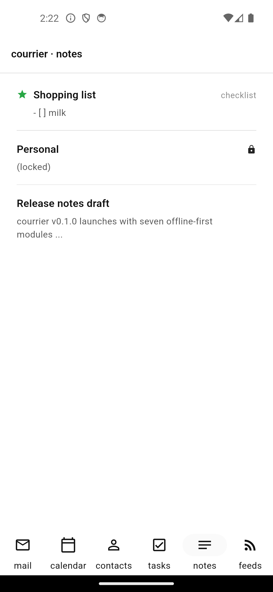

# Notes

{width=320}

Nextcloud Notes (the official Notes app, REST v1) gets a full offline-first
vertical with checklist support, undo/redo, and per-note lock.

## Data model

The M1 schema's `NoteItems` already carries everything M9 needs: `remoteId`
(Nextcloud Notes' int id, stored as text), `etag`, `title`, `category`,
`content`, `kind` (`text` | `checklist`), `favorite`, `locked`, `modified`,
`deletedLocally`. The repository persists every write here first; sync runs
after.

## Checklist round-trip

`ChecklistSerializer` converts `ChecklistItem` lists ↔ markdown task lists:

| In                            | Out                |
| ----------------------------- | ------------------ |
| `- [ ] foo` / `* [ ] foo`     | `ChecklistItem(label: 'foo', checked: false)` |
| `- [x] foo` / `- [X] foo`     | `ChecklistItem(label: 'foo', checked: true)`  |
| plain text line               | label-only item    |

Serialise always emits the canonical `- [ ]` / `- [x]` form, so opening a
note in any other markdown editor (Obsidian, Logseq, …) shows the same thing.
Re-round-trip is stable — verified by
`test/modules/notes/data/checklist_serializer_test.dart`.

## REST client

`NextcloudNotesClient` hits four endpoints under
`/index.php/apps/notes/api/v1/notes`:

- `GET    /` — list every note (returns id / title / content / category /
  favorite / modified / etag).
- `POST   /` — create.
- `PUT    /{id}` — update with `If-Match: <etag>`; surfaces 412 as
  `PreconditionFailedError(observedEtag)`.
- `DELETE /{id}` — delete with `If-Match: <etag>`.

The client takes a `DavCredentials` (reuses M2's `Basic` auth helper) and
exposes a `RemoteNote` value type so the test layer can match on it without
touching the HTTP shape.

## Sync

`NotesSyncBackend` implements the M1 `SyncBackend` interface:

- `pull(accountId)` — for every enabled `kind='notes'` collection on the
  account, lists remote notes, upserts each into `NoteItems` keyed by
  `(collection_id, remote_id)`.
- `push(accountId)` — drains `PendingChanges` rows with
  `entityTable='note_items'`: routes `create` → POST → backfills `remote_id`
  + `etag`; `update` → PUT with If-Match; `delete` → DELETE with If-Match.
  412 → `SyncConflicts` row.

## Editor undo/redo

`NoteEditorHistory` is a bounded snapshot stack (default 50 entries). The
editor commits on every change; identical-to-current commits coalesce so
quick double-presses don't bloat the stack. After undo, a fresh commit
drops the redo future (canonical undo semantics).
`undo_history_test.dart` covers the contract.

## Per-note lock (M11 hooks in)

`NoteRepository.setLocked(id, locked:)` flips the column. The list view
renders a lock icon and obscures the body preview ("(locked)"). The editor
still opens the note — M11 polish wires the actual biometric/PIN prompt
through `core/lock` before showing the content. The M9 invariant is purely
that the lock state round-trips through the DB.

## Open at M9

- A live Nextcloud Notes round-trip test is straightforward to add as an
  opt-in companion to the M3 calendar integration test (same `secrets.json`
  surface). Deferred to M11 polish.
- Server-side conflict resolution UI is M11's `SyncConflicts` dialog — the
  412 → `SyncConflicts` row plumbing is already in place.
